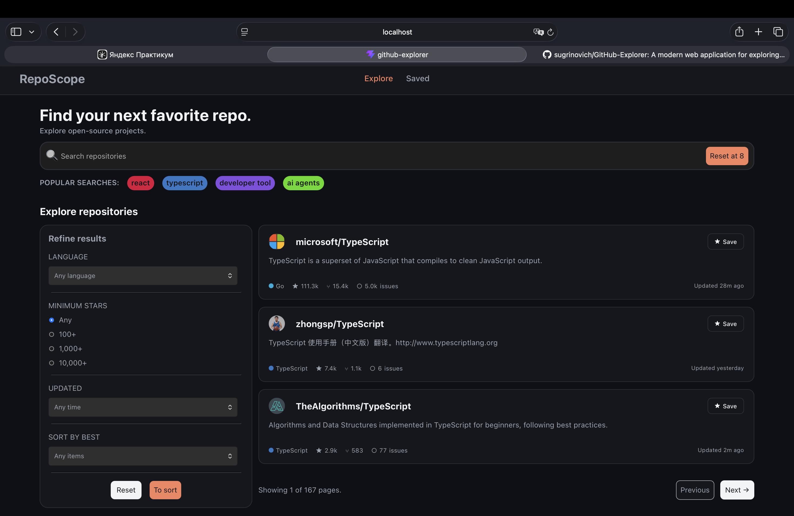

# GitHub Explorer

Веб-приложение для поиска репозиториев на GitHub. Ищите по ключевому слову, уточняйте результаты фильтрами, сохраняйте понравившиеся репозитории в избранное и переходите на GitHub в один клик.



**Демо:** https://github-explorer-aibfhmopf-sugr1.vercel.app

## Возможности

- Поиск репозиториев по ключевому слову через GitHub REST API
- Быстрые теги «Popular searches»: `react`, `typescript`, `developer tool`, `ai agents`
- Фильтры:
  - язык программирования
  - минимальное количество звёзд (Any, 100+, 1,000+, 10,000+)
  - дата последнего обновления
  - сортировка
- Карточки репозиториев: аватар, название, описание, язык, звёзды, форки, открытые issues и время обновления
- Пагинация (Previous / Next)
- Избранное: репозитории можно сохранять и удалять, список хранится в `localStorage` и не пропадает после перезагрузки страницы
- Клик по карточке открывает репозиторий на GitHub в новой вкладке
- Длинные описания обрезаются до 128 символов, если описания нет, показывается «No description»

## Технологии

- [React](https://react.dev/) + [TypeScript](https://www.typescriptlang.org/)
- [Vite](https://vite.dev/)
- [GitHub REST API](https://docs.github.com/en/rest)
- `localStorage` для избранного

## Запуск проекта

### Требования

- Node.js 18 или новее
- npm

### Установка

```bash
git clone https://github.com/<your-username>/github-explorer.git
cd github-explorer
npm install
npm run dev
```

Приложение откроется по адресу `http://localhost:5173` (точный порт выводится в терминале).

### Другие команды

```bash
npm run build     # production-сборка
npm run preview   # локальный просмотр production-сборки
```

## Как это работает

### Запрос поиска

Используется endpoint поиска репозиториев:

```
GET https://api.github.com/search/repositories
```

Пример:

```bash
curl -H "Accept: application/vnd.github+json" \
  "https://api.github.com/search/repositories?q=react+language:typescript+stars:>=1000&sort=stars&order=desc&per_page=3&page=1"
```

| Параметр   | Описание                                                          | Пример                      |
|------------|-------------------------------------------------------------------|-----------------------------|
| `q`        | Поисковый запрос с квалификаторами (`language:`, `stars:`, `pushed:`) | `react language:typescript` |
| `sort`     | Поле сортировки: `stars`, `forks`, `updated`; без него — по релевантности | `stars`                |
| `order`    | `desc` или `asc`                                                  | `desc`                      |
| `per_page` | Результатов на странице (максимум 100)                            | `3`                         |
| `page`     | Номер страницы                                                    | `1`                         |

Фильтры из боковой панели превращаются в квалификаторы внутри `q`:

| Фильтр        | Пример квалификатора  |
|---------------|-----------------------|
| Язык          | `language:typescript` |
| Минимум звёзд | `stars:>=1000`        |
| Обновлено     | `pushed:>=2025-01-01` |

### Пример ответа (сокращённый)

```json
{
  "total_count": 500000,
  "incomplete_results": false,
  "items": [
    {
      "id": 10270250,
      "name": "react",
      "full_name": "facebook/react",
      "owner": {
        "login": "facebook",
        "avatar_url": "https://avatars.githubusercontent.com/u/69631?v=4"
      },
      "html_url": "https://github.com/facebook/react",
      "description": "The library for web and native user interfaces.",
      "language": "JavaScript",
      "stargazers_count": 250000,
      "forks_count": 51000,
      "open_issues_count": 1400,
      "updated_at": "2026-10-01T12:00:00Z"
    }
  ]
}
```

Значения приведены для примера, реальные числа постоянно меняются.

### Поля, которые использует приложение

| Поле                | Тип           | Для чего                                |
|---------------------|---------------|-----------------------------------------|
| `full_name`         | string        | Заголовок карточки                      |
| `owner.avatar_url`  | string        | Аватар                                  |
| `description`       | string / null | Описание                                |
| `language`          | string / null | Язык                                    |
| `stargazers_count`  | number        | Звёзды                                  |
| `forks_count`       | number        | Форки                                   |
| `open_issues_count` | number        | Issues                                  |
| `updated_at`        | string (ISO)  | «Updated 2h ago»                        |
| `html_url`          | string        | Ссылка на репозиторий на GitHub         |
| `total_count`       | number        | Подсчёт количества страниц              |

### Избранное

Сохранённые репозитории записываются в `localStorage` под одним ключом в виде JSON-массива. Кнопка **Save** добавляет репозиторий, кнопка **Delete** удаляет. Если очистить данные браузера, избранное тоже очистится.

## Ограничения

- GitHub Search API работает без токена, но с лимитом: **10 запросов в минуту** для неавторизованных запросов. При превышении GitHub вернёт `403` (или `429`), подождите минуту и повторите.
- Поиск GitHub отдаёт максимум первые **1000** результатов по любому запросу, поэтому количество страниц ограничено.

### Ошибки

| Код | Значение                           |
|-----|------------------------------------|
| 403 | Превышен лимит запросов            |
| 422 | Некорректный поисковый запрос      |
| 503 | GitHub временно недоступен         |

## Структура проекта

```
src/
├── shared/
│   └── components/
│       └── RepoCards/     # карточка репозитория
└── ...
```

> Приведите этот раздел в соответствие с реальной структурой папок.

## Лицензия

MIT.